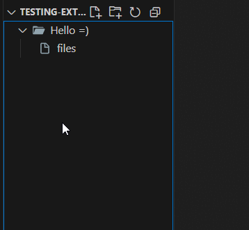

# New Python Package for VS Code

A simple extension that adds a "New Python Package..." option to the Explorer context menu, creating Python package directories with an `__init__.py` file.

## Features

- Adds a "New Python Package..." option right after "New Folder..." in the Explorer context menu
- Creates a Python package directory with an empty `__init__.py` file inside
- Uses VS Code's native folder creation dialog for a seamless experience
- Automatically expands the new package in the Explorer view

## Usage

1. Right-click on any folder in the Explorer view
2. Select "New Python Package..." from the context menu
3. Enter a name for your new package
4. The extension will add an `__init__.py` file automatically

## Requirements

No special requirements or dependencies.

## Extension Settings

This extension does not add any settings.

## Known Issues

Please report issues on the [GitHub repository](https://github.com/Kanin/new-python-package/issues).

## Release Notes

Users appreciate release notes as you update your extension.

### 1.0.0

Initial release of the New Python Package extension.
